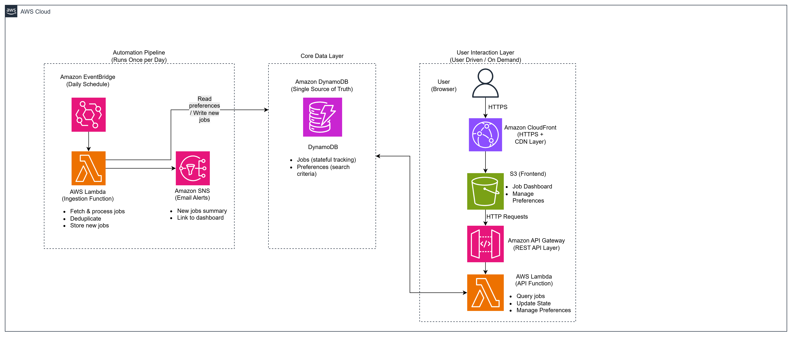

# Serverless Job Ingestion and Tracking System on AWS

This project is a serverless, cloud-native system that automates job discovery while keeping track of how each job is handled. It is built on AWS using an event-driven approach, with a focus on simplicity, cost control, and clear system design.

## Overview

The system runs once per day and fetches job listings based on user-defined preferences such as keywords and location. It filters and processes the results, stores only new jobs, and notifies the user when relevant opportunities are found.

Each job is tracked over time, allowing the user to mark it as applied or ignored. Instead of deleting data, the system maintains state so that previously seen jobs are not shown again.

## Architecture

The system is designed as a simple event-driven pipeline:

- Amazon EventBridge triggers a daily run
- AWS Lambda fetches and processes jobs
- Amazon DynamoDB stores jobs and user preferences
- Amazon SNS sends notifications for new jobs
- A web interface allows users to view and manage jobs

The frontend is hosted on Amazon S3 and delivered via Amazon CloudFront with HTTPS. Backend APIs are exposed through Amazon API Gateway and handled by Lambda functions.

## Key Features

- Automated job discovery based on user preferences
- Idempotent processing to prevent duplicate entries
- Stateful job tracking (NEW, APPLIED, IGNORED)
- Daily notifications for new job listings
- Simple web interface for managing jobs
- Fully serverless architecture

## Design Decisions

This project intentionally keeps the architecture simple and focused.

- DynamoDB is used instead of a relational database to align with serverless patterns and reduce operational overhead
- Jobs are never deleted; only their state changes
- The system runs on a schedule instead of real time to reduce cost and complexity
- Infrastructure is managed using Terraform for reproducibility and easy teardown

## Trade-offs

Some features are intentionally left out to keep the project scoped and practical:

- No authentication or multi-user support (single-user system)
- No automated job applications
- No CV parsing or recommendation logic
- Dependent on external APIs, which may be unreliable or rate-limited

## Cost

The system is designed to run within the AWS free tier. The only consistent cost is domain hosting via Route 53, which is minimal.

## What This Project Demonstrates

- Event-driven architecture on AWS
- Stateless compute with Lambda
- Stateful data management using DynamoDB
- Idempotent data processing
- Infrastructure as code with Terraform
- Cost-aware system design

## Status

Work in progress. This project is being built incrementally, starting with local logic before moving to full cloud deployment.